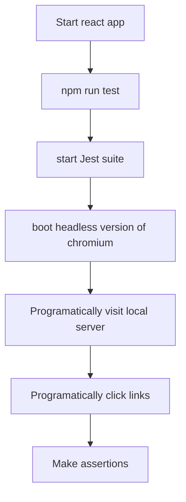

# Advanced Node Project

This project includes some of the advanced concepts.
Both projects i.e react SPA and node backend can be started up using npm run dev defined in package.json, thanks to concurrently.
All the keys are defined in config directory.

## Features

Authentication
CRUD of blogs

### Middlewares

BodyParser
CookieSession
Passport
Require Login

### Routes

Authentication process
CRUD Blog

### Jest

Headless testing, feature testing, automated authentication CI

### React App SPA

Setup in client directory

### Express

### Mongo DB

### Redis

Redis implemention, clear cache when blog is posted, otherwise show blogs from cache

### Passport

Handling authentication from Google Service

###
